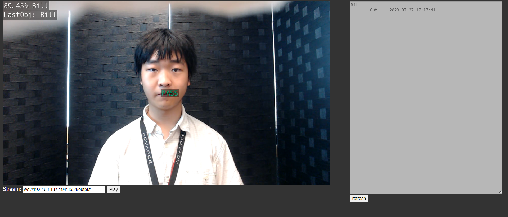
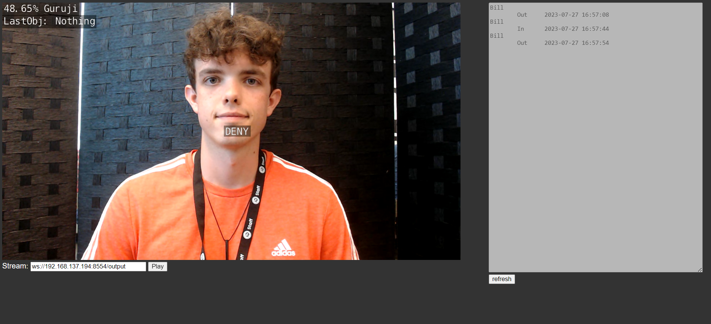

<div align="center">

# Jetson Face Auth

*A practice of embedded AI face authentication*

</div>

<br>

### Intro

This is my first project on jetson.
It does two things:
1. give residence a PASS

2. give bad guy a DENY


Here's a [demo video](https://youtu.be/uvKsbOakS2E) available

<details open>
<summary>

### Training

</summary>

#### My model
This project is **for myself**, which means that my code is optimized for my model. Here's some parameters I use to train the model.
- Specify model `arch=efficientnet_v2_s`
- Turn pretrained off `pretrained=False`
- Set labelID and name of blank background to `3` and `Nothing`

#### Training the model
1. download scripts from `https://github.com/dusty-nv/pytorch-clboldassification`
2. add parameters
    ```
    arch=efficientnet_v2_s
    pretrained=False
    ```
3. Run

</details>

<details open>
<summary>

### Run the project
</summary>

Before running, please make sure that **jetson-inference is installed**. If not, please follow [this guide](https://github.com/dusty-nv/jetson-inference/blob/master/docs/building-repo-2.md) to make install.

#### Running

1. Put model file `.onnx` and `labels.txt` in directory `./models`
2. Rename your model to `target.onnx`
3. Run 
    ```shell
    python3 app.py
    ```
4. Access `http://<jetson-ip>:8050` from browser ()

#### Notes
Since this project is mainly for my own use, the program is optimized for my own model only, which means that this program **does not work out of box**. To make it work with your own model, the following modifications should be made.

##### in `stream.py` line `87`
1. change the number in `max(possibilities) > 80` to a number that fit the accuracy of your model.
2. change `"Nothing" not in classLabel` and `classID!=3` to the correct value of background according to your own model

</details>